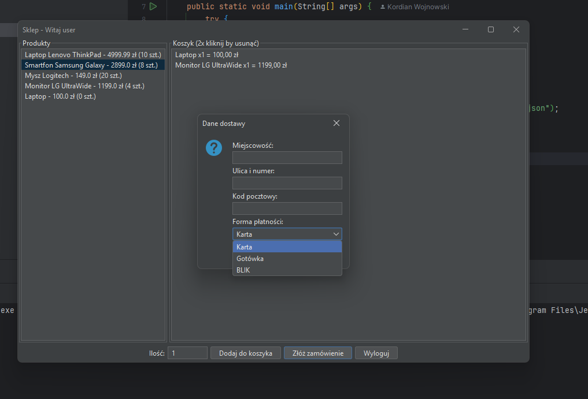
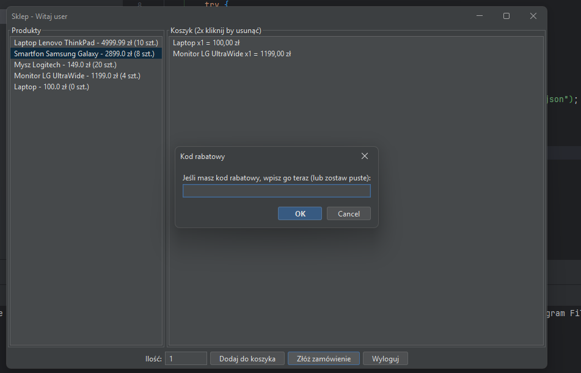
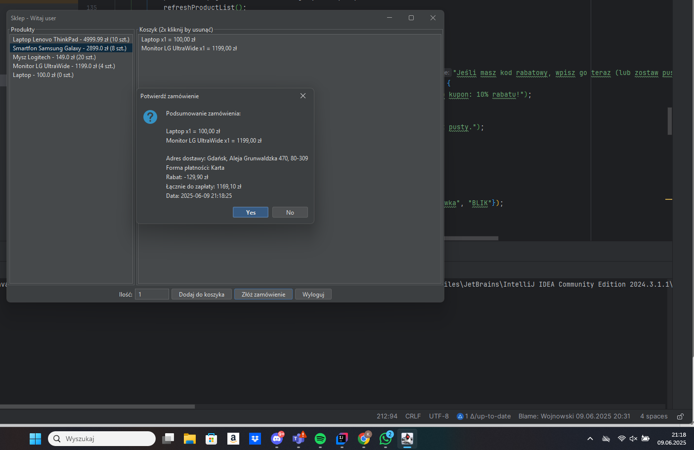

# 🛒 Shop – Java Swing Application

Aplikacja stworzona w oparciu o projekt na studai, w Javie z wykorzystaniem Swinga. Pozwala na:
- Rejestrację i logowanie użytkowników
- Przeglądanie produktów
- Panel administratora z możliwością zarządzania
- Zapis danych do plików `.json`

## 📸 Zrzuty ekranu

### 🔐 Logowanie

### 🛍️ Sklep

### 🧑‍💼 Panel administratora

## ⚙️ Technologie
- Java 17+
- Swing (GUI)
- FlatLaf (ciemny motyw)
- JSON (plikowa baza danych)
- IntelliJ IDEA
